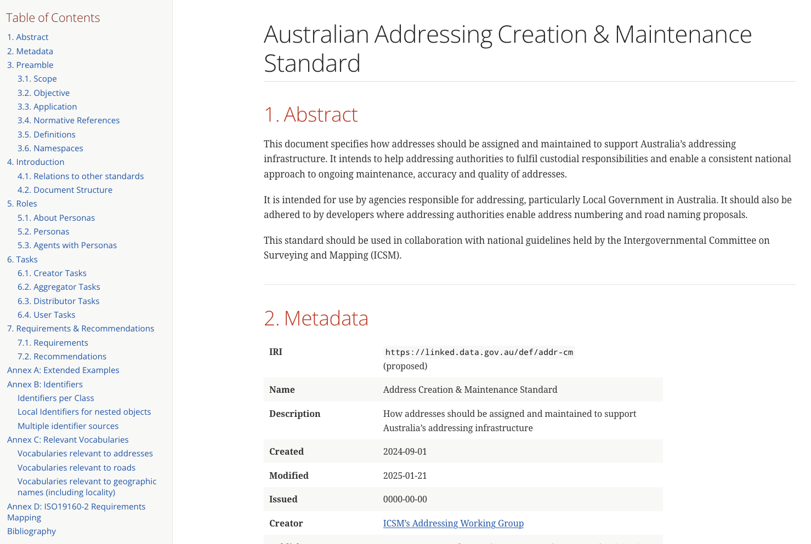

# Addressing

The Addressing Working Group (AWG) coordinates work related to street addresses in Australia & New Zealand. Of primary concern are the representation and data exchange of addressing information between jurisdictions and methods for new address generation and address information maintenance.

## Areas of work

AWG is aiming to greatly improve address generation quality, representation, data interoperability and management processes in all ICSM member jurisdictions over a number of years. To do this it is publishing and expecting to publish resources that tackle different areas of the addressing domain. These areas are:

1. **Strategy**
    * the strategic vision for ANZ addressing
2. **Data Representation and Exchange Rules**
    * how to represent and exchange data for accuracy and interoperability across jurisdictions
3. **Operations Guidance**
    * inter-jurisdictional consensus on how to create and maintain addresses to meet the strategy's objectives and use the new representation and exchange rules

## Resources

The statuses of AWG resources in the areas of work are as follows:

| **Area of work**                       | **Resource**                            | **Status**                   | **Dates**                    | **Notes**                                                                                                           |
|----------------------------------------|-----------------------------------------|------------------------------|------------------------------|---------------------------------------------------------------------------------------------------------------------|
| Strategy                               | Addressing 2035 Strategy                | Published                    | December, 2021               |                                                                                                                     |
| Data Representation and Exchange Rules | ICSM ANZ Address Model                  | Published & approved for use | July, 2024                   | Open to updates & supplementary resource publication                                                                |
| Operations Guidance                    | Address Creation & Maintenance Standard | Early Draft                  | Expected publication in 2025 | Replacement for [AS4189](https://www.icsm.gov.au/what-we-do/addressing/standards-rural-and-urban-addressing-as4819) |

### 1. Addressing 2035 Strategy

AWG has published “Addressing 2035”, a strategy which defines a vision and roadmap to deliver a dynamic and integrated whole of Government addressing ecosystem, to enable service delivery and support a 3D and 4D digital economy.

* [Addressing 2035 Strategy](https://www.icsm.gov.au/sites/default/files/ICSM%20Addressing%202035%20Strategy%20%28Final%29.pdf)
    * [Addressing 2035 Supporting Addendum](https://www.icsm.gov.au/sites/default/files/ICSM%20Addressing%20Strategy%20Information%20Addendum.pdf)

### 2. Address Model

AWG has published the "ICSM ANZ Address Model" which is a model for address information representation and data exchange that both builds on the [ISO19160-1 _Addressing Part 1: Conceptual model_](https://www.iso.org/standard/61710.html) and specifically addresses the "Model Directions" of the _Addressing 2035 Strategy Supporting Addendum_.

* <https://linked.data.gov.au/def/addr>

The Address Model has the following parts:

* human-readable documentation
* machine-readable model schemas
* supporting vocabularies
    * these are independently published by ICSM on [ICSM's Vocabulary Server]()
* data validators
* extended examples

### 3. Address Creation & Maintenance Standard

This standard, which is in early draft as of March 2025, is intended to be a replacement for [AS/NZS 4819:2011 Rural and urban addressing](https://www.icsm.gov.au/what-we-do/addressing/standards-rural-and-urban-addressing-as4819).

The need for a replacement has been the publication of the Strategy and the Model which require published guidance in areas not tackled by AS4189 and the incorporation of model use in address data generation and exchange. This new standard will also depend on and reference the developing [_Geographical Names Creation & Maintenance Standard_ (proposed)](https://linked.data.gov.au/def/gn-cm), for instance with respect to guidance on how addresses can incorporate geographical names.

This resource is soon to be reviewed by AWG members (by June, 2025) and is expected to be published within 2025.

## Further Information

Any questions or comments on Addressing 2035 can be directed to the Chairperson of the Addressing Working Group, via ICSM at <icsm@ga.gov.au>.

---

## Notes

* change title from initiative - 'Addressing 2035' - to persistent function 'Addressing'
* change first intro paragraph to describe the continued role of the Addressing WG 
    * retain Addressing 2035 information in a subsection
* addition of a generic "Areas of work" to indicate what, of all the address-related things, the AWG does
* listing of the Resources and their statuses
    * info on each is retained from before (for the Strategy) and taken from the published documents (for the Model) 