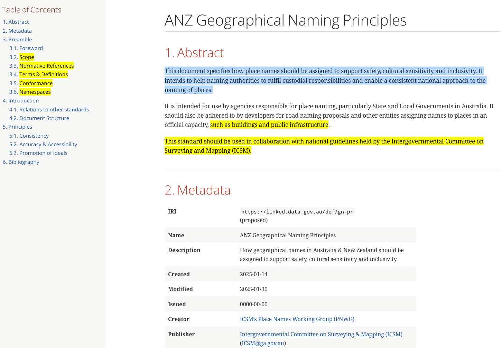
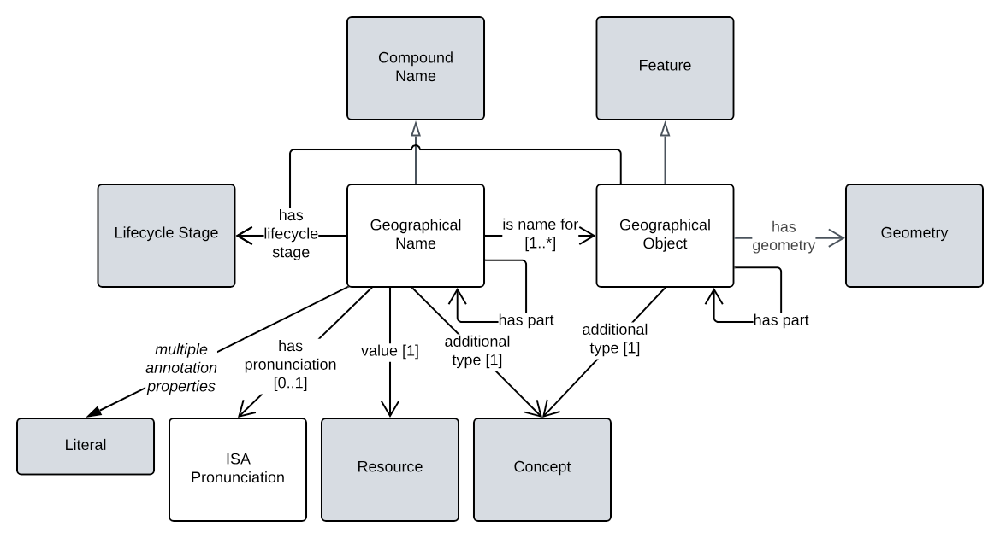

# Place Names

We all use place names everyday to describe our surroundings, where we’re going or where we’ve been.

Rivers, mountains, plains, towns, suburbs, reefs, shoals and undersea features all have names. Whether they are of national or international importance or known only to a handful of people, names connect places to their local communities and often reflect our heritage and culture.

Standardising how we name places and making comprehensive place names data easily accessible are an important goal for names authorities around the world. Through a standardised approach we can expect benefits across a wide range of applications such as communications, data integration, statistics, service delivery, emergency response, and sustainable development.

Place names are recognised as foundation spatial data and the [Intergovernmental Committee on Surveying and Mapping (ICSM)](https://www.icsm.gov.au/) supports cooperation between the place name authorities in Australia and New Zealand. ICSM’s interest in place names is coordinated through a subcommittee, the [Place Names Working Group (PNWG)](https://www.icsm.gov.au/what-we-do/place-names/australia-and-new-zealand-working-group-place-names).

While the PNWG facilitates coordinated and cohesive approaches across names authorities in Australia and New Zealand, each country maintains its own place name databases and country specific principles and guidelines.

* [Go to place name databases and information for Australia](https://www.icsm.gov.au/what-we-do/place-names/australian-place-names) 

* [Go to place name databases and information for New Zealand](https://www.icsm.gov.au/what-we-do/place-names/new-zealand-place-names)

## Areas of work

The [PNWG](https://www.icsm.gov.au/what-we-do/place-names/australia-and-new-zealand-working-group-place-names) is aiming to greatly improve place names generation quality, representation, data interoperability, use within addressing data and name management processes in all ICSM member jurisdictions over a number of years. To do this it is publishing and expecting to publish resources that tackle different areas of the place naming domain. These areas are:

1. **Strategy**
    * the strategic vision for Place Naming that improves Place Names and their related work in ANZ according to the Principles
2. **Principles**
    * agreeing on and stating the principles of place naming, as distilled from PNWG work over decades and international Best Practice
3. **Data Representation and Exchange Rules**
    * how to represent and exchange data for accuracy and interoperability across jurisdictions
4. **Operations guidance**
    * inter-jurisdictional consensus on how to create and maintain Place Names to meet the principles, strategy's objectives and use the new representation and exchange rules

## Resources

The statuses of PNWG resources in the areas of work are as follows:

| **Area of work**                       | **Resource**                                       | **Status**         | **Dates**                         | **Notes**                                                                                                             |
|----------------------------------------|----------------------------------------------------|--------------------|-----------------------------------|-----------------------------------------------------------------------------------------------------------------------|
| Strategy                               | ICSM Geographical Naming 203X Strategy             | Not started yet    | Expected publication in 2025/2026 |                                                                                                                       |
| Principles                             | ICSM Geographical Naming Principles                | Early draft        | Expected publication in Q2, 2025  |                                                                                                                       |
| Data Representation and Exchange Rules | ICSM Geographical Names Model                      | Created & proposed | July, 2024                        | Created and in use (Qld), not yet approves for national use Open to updates & supplementary resource publication |
| Operations Guidance                    | Geographical Names Creation & Maintenance Standard | Early Draft        | Expected publication in 2025      |                                                                                                                       |

### 2. ICSM Geographical Naming 203X Strategy

The Strategy will indicate how jurisdictions and meet the expectations of the _Principles_.

The PNWG aims to publish a Strategy in 2025 that is similar in scope to the [Addressing 2035 Strategy](https://www.icsm.gov.au/what-we-do/addressing). Work on this Strategy has not yet produced publicly available resources yet.

### 1. ICSM Geographical Naming Principles 

The _ICSM Geographical Naming Principles_ "specifies how place names should be assigned to support safety, cultural sensitivity and inclusivity. It intends to help naming authorities to fulfil custodial responsibilities and enable a consistent national approach to the naming of places".

Is in early draft at:

* <https://linked.data.gov.au/def/gn-pr>

### 3. ICSM Geographical Names Model

Queensland Government has developed and is using a data model for Place Names that builds on the [ICSM Address Model](https://www.icsm.gov.au/what-we-do/addressing) that was published in 2024.

This model will soon be proposed for national adoption, once the Principles and Strategy have been delivered so it can be assured to uphold them.

The model is online at

* <https://linked.data.gov.au/def/gn>

The Geographical Names Model has the following parts:

* human-readable documentation
* machine-readable model schemas
* supporting vocabularies
    * these are independently published by ICSM on [ICSM's Vocabulary Server]()
* data validators
* extended examples

### 4. Geographical Names Creation & Maintenance Standard

This standard, which is in early draft as of March 2025, is intended to be for Place Names what the [_Addressing Creation & Maintenance Standard_ (proposed)](https://linked.data.gov.au/def/addr-cm) is for addressing. The standards will depend on and reference one another, for instance with respect to guidance on how addresses can incorporate geographical names.

The need for a replacement has been the publication of the Strategy and the Model which require published guidance in areas not tackled by AS4189 and the incorporation of model use in address data generation and exchange.

This resource is hoped to be made available in 2025.

## Further Information

Any questions or comments on Addressing 2035 can be directed to the Chairperson of the Addressing Working Group, via ICSM at <icsm@ga.gov.au>.

--- 

## Notes

### Web page structure

The current structure is:

* Place Names
  * Place Names Working Group
      * History and Legacy
      * Australian Place Names
      * New Zealand Place Names
  * Australian Place Names
  * New Zealand Place Names
  * Community Domain Names

I propose the following structure:

* Place Names
  * Place Names Working Group
  * Australian Place Names
  * New Zealand Place Names
  * Community Domain Names

The section "History and Legacy" is not long and neither is the page "Place Names Working Group" so these can be merged and an unnecessary website 3rd submenu removed.

The "Australian Place Names" & "New Zealand Place Names" links are duplicated making it look like there is more content there than there really is. They should be deduplicated.

### Place Names page content

Proposed as above.

All original introductory text retained with new sections added, as per the Addressing WG content.

### Place Names WG page content

No change proposed other than the incorporation of the ["History and Legacy" paragraphs](https://www.icsm.gov.au/what-we-do/place-names/australia-and-new-zealand-working-group-place-names/history-and-legacy) and the addition of a visible page heading.

### Geographical Names

* Should the name be changes from "Place Names" to "Geographical Names" everywhere?
    * Perhaps this can be stepwise changed: new page content now then the name changed everywhere.